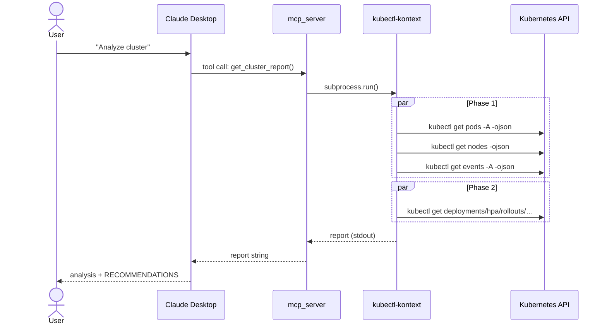

# Architecture

## Component Overview

```
┌─────────────────────────────────────────────────────────────────┐
│                        Claude Desktop                           │
│                                                                 │
│   User prompt ──► Claude LLM ──► tool call decision             │
│                        ▲                │                       │
│                        │         MCP client (stdio)             │
└────────────────────────│────────────────│────────────────────── ┘
                         │                │ spawn + stdio pipe
                         │                ▼
┌────────────────────────│────────────────────────────────────────┐
│                   mcp_server  (FastMCP)                      │
│                                                                 │
│   tools:                                                        │
│   ├── get_cluster_report   ──► subprocess.run(kubectl-kontext)  │
│   ├── get_current_context  ──► kubectl config current-context   │
│   └── switch_context       ──► kubectl config use-context       │
│                                                                 │
└─────────────────────────────────┬───────────────────────────────┘
                                  │ subprocess
                                  ▼
┌─────────────────────────────────────────────────────────────────┐
│              kubectl-kontext  (Go binary)                       │
│                                                                 │
│   Phase 1 (parallel):  kubectl get pods/nodes/events            │
│   Phase 2 (parallel):  kubectl get deployments/hpa/rollouts/…   │
│   Phase 3 (sequential): assemble report via jq                  │
│                                                                 │
└─────────────────────────────────┬───────────────────────────────┘
                                  │ kubectl + kubeconfig
                                  ▼
                    ┌─────────────────────────┐
                    │   Kubernetes Cluster    │
                    │   (API server :6443)    │
                    └─────────────────────────┘
```

## Sequence



## Process Lifecycle

Claude Desktop reads `claude_desktop_config.json` on startup and spawns `mcp_server.py`
as a child process connected via **stdio pipe** (not a TCP port). The server stays alive
for the session and handles tool calls on demand. Switching contexts with `switch_context`
modifies the kubeconfig file in place — no server restart needed.

```
claude_desktop_config.json
  └── command: uv run /path/to/mcp_server.py
        └── env: KUBECONFIG=/path/to/.kube/config
```
